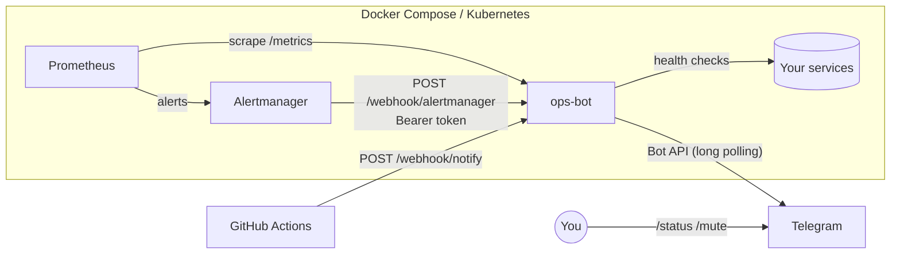

# ops-bot

A Telegram bot for infrastructure alerts and service status.

- Receives **Prometheus Alertmanager** webhooks and posts readable alerts to Telegram
- Accepts generic **CI/CD notifications** (deploy succeeded / failed) on `/webhook/notify`
- Runs its own **HTTP health checks** and alerts on DOWN / RECOVERED, with flap protection
- `/status` from your phone: live check of every target with latency
- Exposes **Prometheus metrics** about itself on `/metrics`
- Shipped as a hardened container, with Kubernetes manifests and a CI pipeline (lint → tests → manifest validation → image build → vulnerability scan → push to GHCR)

## Architecture



One asyncio process runs both the Telegram client (long polling) and an aiohttp server for webhooks, probes and metrics.

## Commands

| Command | What it does |
|---|---|
| `/start` | Shows your chat id (open to anyone, used during setup) |
| `/status` | Checks all targets now |
| `/targets` | Lists monitored targets |
| `/mute 30` | Mutes alerts for 30 minutes (max 24 h) |
| `/unmute` | Unmutes alerts |
| `/uptime` | Bot uptime |

All commands except `/start` are restricted to `ALLOWED_CHAT_IDS`.

## HTTP endpoints

| Method | Path | Auth | Purpose |
|---|---|---|---|
| GET | `/healthz` | — | Liveness / readiness probe |
| GET | `/metrics` | — | Prometheus metrics |
| POST | `/webhook/alertmanager` | Bearer | Alertmanager webhook (v4 payload) |
| POST | `/webhook/notify` | Bearer | `{"title", "text", "level": success\|failure\|warning\|info, "url"}` |

```bash
curl -X POST http://localhost:8080/webhook/notify \
  -H "Authorization: Bearer $WEBHOOK_SECRET" -H "Content-Type: application/json" \
  -d '{"title":"Deploy api v1.4.2","text":"prod, 3/3 pods ready","level":"success"}'
```

## Quick start

1. Create a bot with [@BotFather](https://t.me/BotFather) (`/newbot`) and copy the token.
2. Configure:
   ```bash
   cp .env.example .env
   # TELEGRAM_TOKEN=...   WEBHOOK_SECRET=$(openssl rand -hex 32)
   ```
3. Start only the bot, send it `/start` in Telegram, and put the chat id it replies with into `ALERT_CHAT_IDS`:
   ```bash
   docker compose up -d --build ops-bot
   ```
4. Run the full stack (bot + Prometheus + Alertmanager):
   ```bash
   docker compose up -d --force-recreate
   ```
   Prometheus: http://localhost:9090 · Alertmanager: http://localhost:9093

Edit `config/targets.yaml` to choose what gets health-checked.

### Local development

```bash
python -m venv .venv && . .venv/bin/activate
make install
make lint test
make run
```

## Deploying to Kubernetes

```bash
kubectl create namespace ops-bot
kubectl -n ops-bot create secret generic ops-bot --from-env-file=.env
# set your image in k8s/kustomization.yaml (ghcr.io/<you>/ops-bot:<tag>)
kubectl apply -k k8s/
kubectl -n ops-bot rollout status deploy/ops-bot
```

Design notes:

- **Single replica with `Recreate` strategy.** Telegram allows only one long-polling consumer per token. A rolling update would briefly run two pods and the old one would get `409 Conflict`.
- **Hardened pod.** Non-root UID 10001, read-only root filesystem, all capabilities dropped, seccomp `RuntimeDefault`, no service-account token.
- **Targets live in a ConfigMap** (`k8s/targets.yaml`), so changing what's monitored doesn't require a new image.
- Secrets come from a Kubernetes Secret. In a real cluster, use External Secrets or Sealed Secrets.

The **Deploy** workflow (`.github/workflows/deploy.yml`, manual trigger) applies the manifests with a chosen image tag, waits for the rollout, and reports the result to Telegram through the bot's own `/webhook/notify`.

## Security

- Webhooks require `Authorization: Bearer <WEBHOOK_SECRET>`, compared in constant time.
- Every label and annotation is HTML-escaped before it goes to Telegram.
- The bot token is never logged (httpx request logging is turned down).
- CI fails on CRITICAL fixable vulnerabilities in the image (Trivy).

## Metrics

| Metric | Type |
|---|---|
| `opsbot_target_up{target}` | gauge |
| `opsbot_target_latency_seconds{target}` | gauge |
| `opsbot_webhooks_total{source,result}` | counter |
| `opsbot_commands_total{command}` | counter |
| `opsbot_messages_sent_total` / `opsbot_send_errors_total` | counter |

Alert rules built on these metrics are in `monitoring/alert.rules.yml`.

## Project layout

```
app/            bot, webhook server, health checks, formatting, metrics
config/         targets for docker compose / local runs
k8s/            Namespace, Deployment, Service, kustomize ConfigMap
monitoring/     Prometheus, alert rules, Alertmanager config
tests/          pytest suite (no network needed)
.github/        CI and deploy workflows
```
